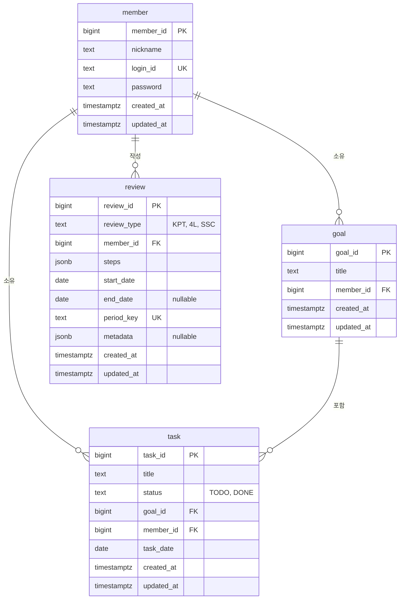

# Loop ERD

```mermaid
erDiagram
    member {
        bigint member_id PK
        text nickname
        text login_id UK
        text password
        timestamptz created_at
        timestamptz updated_at
    }

    goal {
        bigint goal_id PK
        text title
        bigint member_id FK
        timestamptz created_at
        timestamptz updated_at
    }

    task {
        bigint task_id PK
        text title
        text status "TODO, DONE"
        bigint goal_id FK
        bigint member_id FK
        date task_date
        timestamptz created_at
        timestamptz updated_at
    }

    review {
        bigint review_id PK
        text review_type "KPT, 4L, SSC"
        bigint member_id FK
        jsonb steps
        date start_date
        date end_date "nullable"
        text period_key UK
        jsonb metadata "nullable"
        timestamptz created_at
        timestamptz updated_at
    }

    member ||--o{ goal : "소유"
    member ||--o{ task : "소유"
    member ||--o{ review : "작성"
    goal ||--o{ task : "포함"
```
